# Building Daily News Pipeline in Fabric

## Project Overview

This project is inspired by Mr. K Talks Tech's YouTube video: [Build Your End-to-End Project in Just 3 Hours: Master Azure Data Engineering | Bing Data Analytics](https://youtu.be/yHU9ADk10eQ?si=-_hUBjgTU65DZ35a). All credits go to them.

This project automates the process of collecting and analyzing the latest news using the Bing Web Search API and Microsoft Fabric. The goal is to gather fresh news daily, perform sentiment analysis on news articles, and display the results in a Power BI dashboard. The pipeline is built using Microsoft Fabric components, including Data Factory, Lakehouse, Jupyter Notebooks, and Power BI, ensuring smooth orchestration, processing, and visualization of news data. Alerts are configured to notify when new data is available, allowing for timely reviews.

Project is using Bing's [Web Search API](https://www.microsoft.com/en-us/bing/apis/bing-web-search-api) as data source.

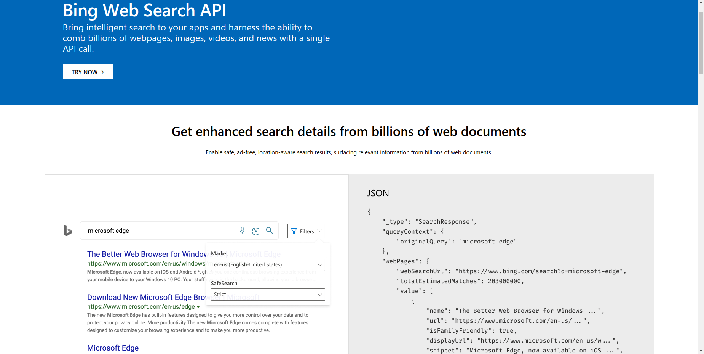

## Technologies Used

Project is based on Microsoft Fabric. These technologies from within Fabric were used.

- **Storage**
  - Azure Lakehouse (both raw files and tables)
- **Processing and orchestration**
  - Jupyter Notebooks (PySpark)
- **Orchestration**
  - Data Factory
- **Visualization**
  - PowerBI
- **Alerts and Notifications**
  - Data Activator (reflex)

## Architecture

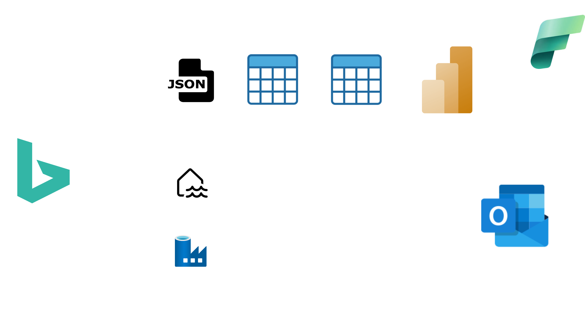

### Data Factory Pipeline

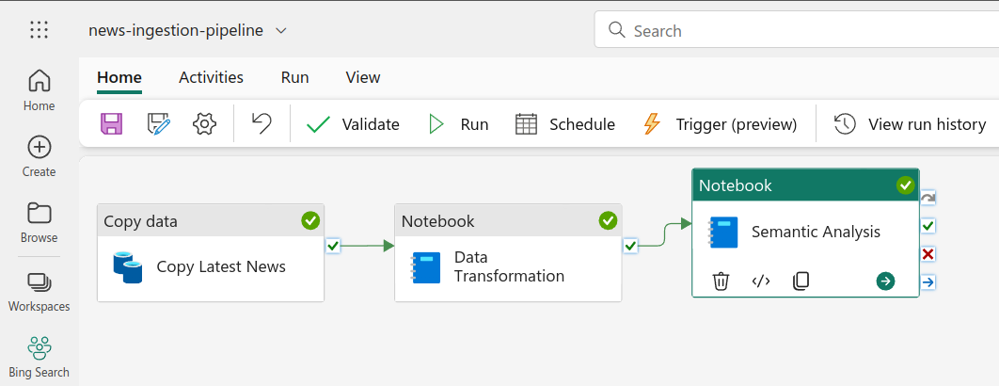

The pipeline consists of the following main tasks:
1. **Copy Latest News**: Query Bing Web Search API for "latest news" and write the result as *latest_news.JSON* to the lakehouse
2. **Data Transformation**: Transform *latest_news.JSON* to a table
3. **Sentiment Analysis**: Apply pre-trained ML model to tell if, for example, Article A has a positive, negative or neutral semantic. (based on its description)

### Power BI Report

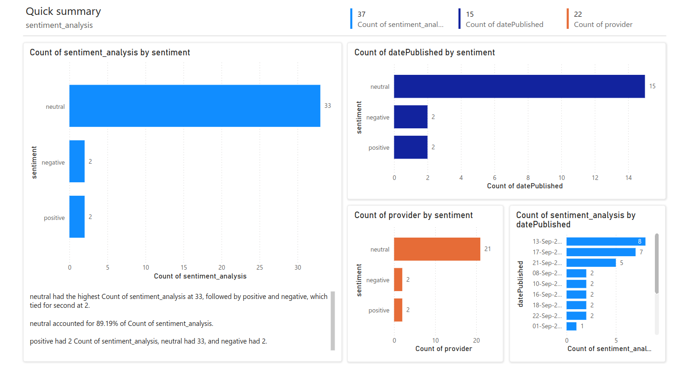
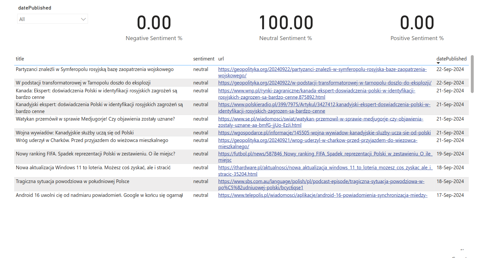

💡 I applied several nice concepts in this report:
1. Auto-generated page 1 of the report using Fabric's AI capabilities.
2. On page 2, I set the report to only show latest 3 days available. (most of people looking at news are interested in latest news only)
3. I generated an alert that sends me an e-mail every time total count of rows changes. (I then know that a new "batch" of news arrived, and I should review the report)

## Concepts Implemented

- **Type 1 SCD (Slowly Changing Dimension)**: In type 1 updates, entire row gets overwritten whenever there's any change to the record.
  - Example: If I have a record with a news "Los Angeles Lakers have lost" (value A), and some editor will change the name to "Los Angeles Lakers have lost badly" (value B), value A will be overwritten by value B. There will be no trace of value A in the table.

## Setup

### 1. Azure
1. Create Bing Resource (standard version is free, and it'll be enough for this project)

### 2. Microsoft Fabric
1. Set up Microsoft Fabric (60 days free trial)
2. Create new Space *Bing Search*

#### 2.1. **Lakehouse**
1. Go to Data Engineering
2. Create Lakehouse `bing_lakehouse`

#### 2.2. **Notebooks**
1. Go to Data Science
2. Create New Notebook (`Process raw JSON file`): 
   - Write a notebook, change all items marked with `#TODO` (Code available in `./notebooks` subdir in this repo)
   - Add Lakehouse (`bing_lakehouse`) as source
3. Create New Notebook (`Bing Sentiment Analysis`): 
   - Write a notebook, change all items marked with `#TODO` (Code available in `./notebooks` subdir in this repo)
   - Add Lakehouse (`bing_lakehouse`) as source

#### 2.3. **Pipeline**

Go to Data Engineering & create new Data Pipeline named `news-ingestion-pipeline`

Before creating tasks, click on empty area and create a parameter named `search_term` with a default value `latest news`.

Then, create the following tasks in the pipeline:

1. **Copy Data (`Copy Latest News`)**
   - Source:
     - Connection: New >> REST >> Details as below
       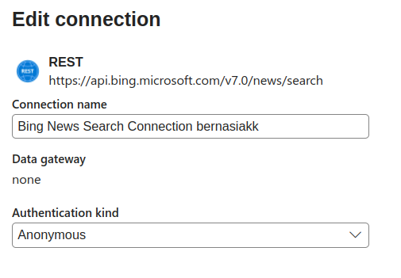
     - Relative URL: `?q=@{pipeline().parameters.search_term}&count=100&mkt=pl-PL`, where:
       - `?q=@{pipeline().parameters.search_term}`: it is a typical search query. It uses the parameter "latest news" we created in step 2
       - `count=100`: increase count of news from 10 (standard) to 100
       - `mkt=pl-PL`: limit news to Poland market\
       (you can play with different parameters using [News Search APIs v7 query parameters](https://learn.microsoft.com/en-us/bing/search-apis/bing-news-search/reference/query-parameters))
     - Additional headers >> New:
       - Name: `Ocp-Apim-Subscription-Key` (taken from [News Search API v7 headers](https://learn.microsoft.com/en-us/bing/search-apis/bing-news-search/reference/headers) documentation)
       - Value: `Insert value of endpoint key from your Bing Search resource in azure`
         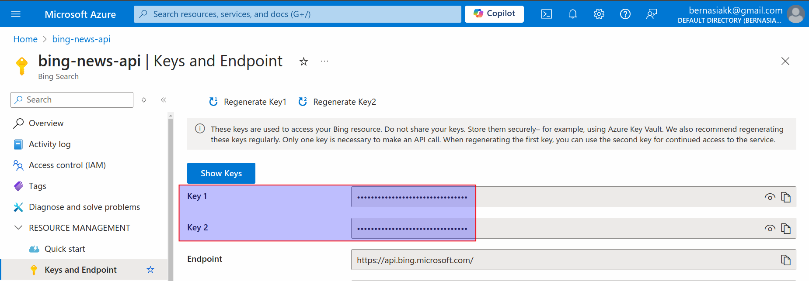
   - Destination: as per the below screenshot
     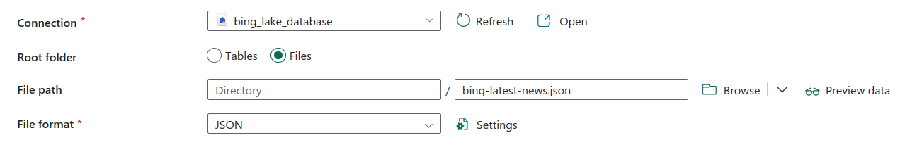
2.  **Notebook (`Data Transformation`)**
  - Settings:
    - Workspace: `Bing Search`
    - Notebook: `Process raw JSON file` (created in earlier step)
3. **Notebook (`Sentiment Analysis`)**
  - Settings:
    - Workspace: `Bing Search`
      - Notebook: `Bing Sentiment Analysis` (created in earlier step)

#### 2.4. **Semantic**
Move to this step after you ran the above pipeline at least once.

**Create the model**
1. Go to your `bing_lakehouse`
2. Select a table `sentiment analysis`
3. Create New semantic model
   - name it `news-dataset`
   - select table `sentiment_analysis`

Once you created the semantic model, you can modify it:
1. Go to model
2. Click `Open Data Model`
3. Change data category of the `url` column:
   - Click `url`
   - Go to properties
   - Change data category to `Web URL`.\
    (This will change the url column into a hyperlink in your report, which you'll create in the next step)\
  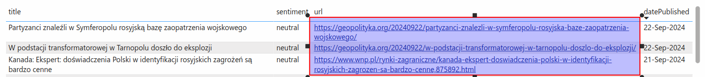
1. Add new measures (`Negative Sentiment %`, `Positive Sentiment %`, `Neutral Sentiment %`):
   - Click `New Measure`
   - Add three new measures using the code in `./semantic_model` subdir\
    (You can use those measure when creating a PowerBI report (next step))
    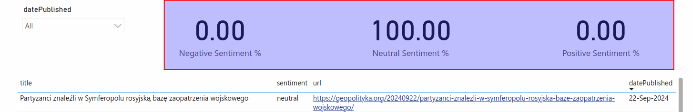

#### 2.5. **Power BI**
1. Go to your semantic model `news-dataset`
2. Click `Explore this Data` >> `Auto-Generate report`
3. AI will auto-genearte a nice report for you.
4. You can add a new page to create custom report (using custom measures and modified columns which you did earlier)

#### 2.6. **Data Activator**

If you want to set an alert:
1. right-click on a measure in your Power BI report
2. Click set alert
3. Change condition
4. Select action (email or teams)

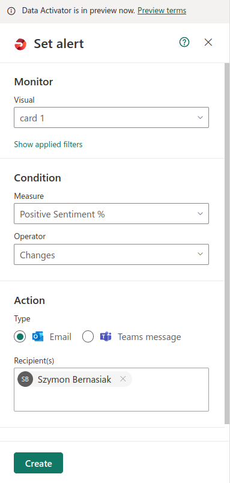

## Usage

1. **Run ETL Pipeline**: Trigger the pipeline to start the data migration process.
2. **Schedule ETL Pipeline**: You can schedule your pipeline to run daily at 6AM, giving you fresh news every morning
3. **Alert**: You'll be notified every time you anything changes in your report. (so you know new news are there!)
4. **Monitor**: You can use Fabric's Monitor functionality to see the runs
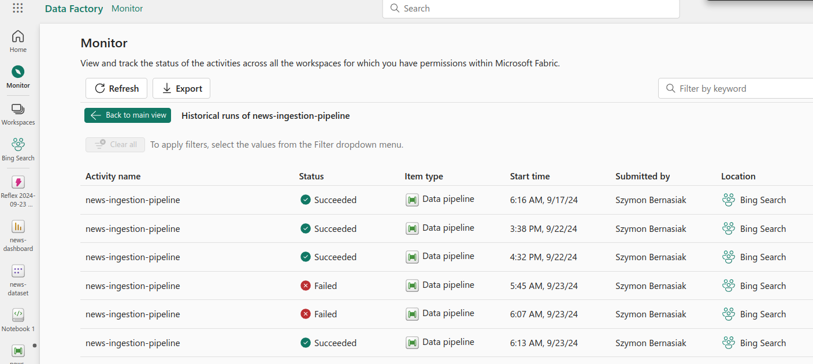

## Contact
For any questions or inquiries, please contact me at bernasiakk@gmail.com

Thanks for reading!